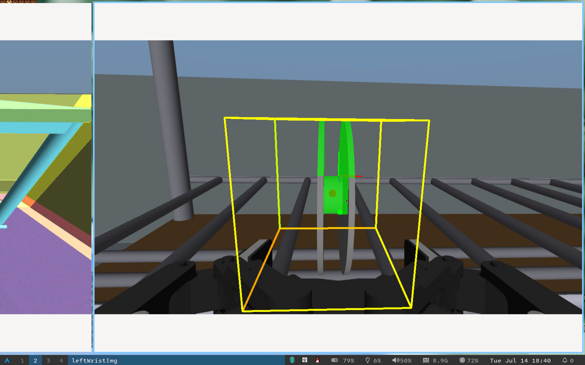
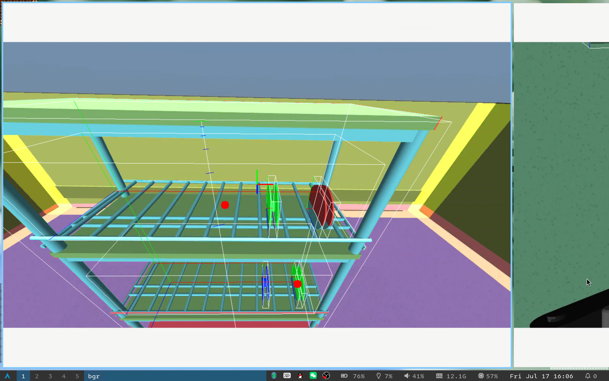

# 综述

任务三的动作执行是一个多阶段状态机，驱动机器人在货架与桌子之间往返，完成上层料盘抓取、下层料盘抓取、转身靠近桌子、双臂依次投放的完整流程。


# 状态机总览

```
WALK_TO_SHELF
    │
    ▼
SIDE_SHIFT ──────────────────────┐
    │                             │ (back_for_lower 后)
    ▼                             │
POST_SIDE_SHIFT                   │
    │                             │
    ├─ current_grab_layer==1 ──► UPPER_HAND_READY
    │                                 │
    └─ current_grab_layer==0 ──► LOWER_HAND_READY
                                      │
                                      ▼
                                 LOWER_ARM_READY
                                      │
                                      ▼
                                  GRAB_SMT
                                      │
                                      ▼
                               CLOSE_AND_LIFT
                                      │
                          ┌───────────┴───────────┐
                          │ (上层)                 │ (下层)
                          ▼                        ▼
                   BACK_FOR_LOWER              BACK_HOME
                          │                        │
                          │ (复位 approach_plan,     │
                          │  回到 SIDE_SHIFT)        ▼
                          └────► SIDE_SHIFT    TURN_BACK_TABLE
                                                   │
                                                   ▼
                                            WALK_TO_TABLE
                                                   │
                                                   ▼
                                           TABLE_SIDE_SHIFT
                                                   │
                                                   ▼
                                    TABLE_PRE_APPROACH_ARM_READY
                                                   │
                                                   ▼
                                    TABLE_POST_SIDE_SHIFT
                                                   │
                                                   ▼
                                      TABLE_WAIST_ALIGN
                                                   │
                                                   ▼
                                       TABLE_ARM_READY
                                                   │
                                                   ▼
                                       PLACE_NEXT_HAND ◄──────┐
                                                   │           │ (retry / 下一只手)
                                                   ▼           │
                                      PLACE_RELEASE_HAND ─────┤
                                                   │           │
                                                   ▼           │
                                      PLACE_RETRACT_HAND ─────┘
                                                   │
                                          (双手完成 → 任务结束)
```

# 各阶段

## 靠近货架
- 首先计算最优的一上一下两个料盘，使得水平距离约为肩部宽度，算得的两个料盘所在层的索引贯穿整个夹取流程
- 接近货架时，尽量使机器人肩部关节与料盘对齐，减少后续手臂的动作，防止 IK 求解失败或者动作幅度过大

## 抓取料盘
- 手臂使用预设轨迹防止与货架碰撞
- 视觉快照冻结：手臂遮挡头相机前，将最后一次有效检测的 plan / AABB / basis 冻结，后续腕相机阶段仅依赖此快照
- 使用先前头部摄像头的最优目标料盘位置，框定一个 AABB 区域，坐标变换到腕部，使用腕部摄像机识别其中，得到精细的料盘中心

- 横向纵向分段矫正，每一段都使用插值法保证姿态连续，防止 1) IK 求解出的姿态突变碰倒料盘，2) 重力补偿导致的抖动被插值法放大
- 先抓取上层货架，后抓取下层，抓取完上层之后不重新计算最优料盘，而是使用冻结的料盘索引


## 货架回桌子
- 利用墙面法线方向与初始值做点积判断转角。机器人转过 180° 后，点积 <= -0.99

## 投放
- 依旧使用预设轨迹防止手臂+料盘与桌子边缘碰撞
- 用腰部补偿手臂够不到的地方

