# 综述

任务三中，机器人不只需要在桌前操作，而是需要在货架和桌之间来回移动。此种复杂的情景任务中，感知是很重要的一环。
我们使用主要基于头部，手部相机的数据进行机器人对周围的感知，进而实现定位，定向与导航。

# 数据使用

任务三的感知部分中，我们使用了头部的一台RGB相机，以及头部和手部共三台深度相机的数据，同时，我们也使用了camera_info和来自TF树的机器人姿态数据。

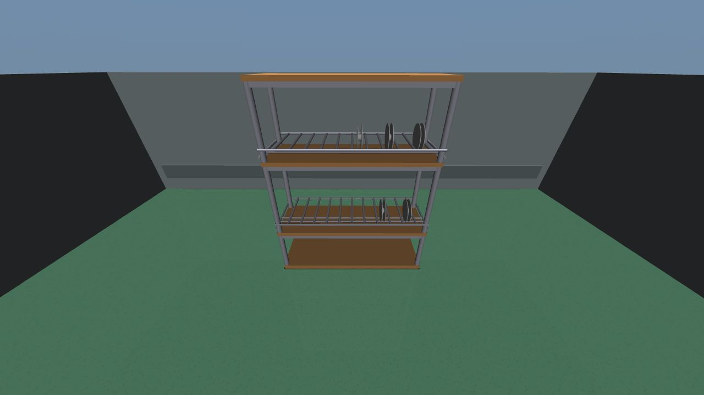
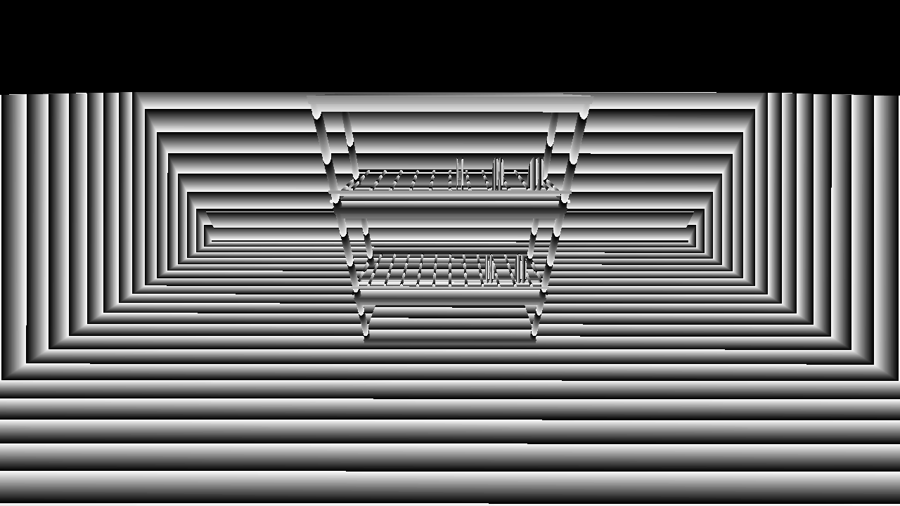

# 主体思路

任务三具有如下的一些特征：

任务三场景中，料盘与货架；出料框与操作桌具有主从关系，次要物体依附于主要物体而存在，并且有一定的几何关系；另外注意到货架，操作桌都与矩形房间的两根主轴方向对齐。

任务三执行动作中，头部总是有更为宽阔的视野，手部则会接近料盘。

故设计如下思路：

头部：
- 确定坐标系。
- 根据计算得出特定物体的AABB。

手部
- 根据头部给出的粗AABB变换到手部坐标系。
- 根据AABB校准后重新定位，以指导手部动作。

# 管线设计

头部侧的计算，侧重于环境整体的特征提取和分类。
输入有两张纹理，来自于头部相机，分别记为bgr和depth。

## 第一部分 确定坐标系
我们先确定一个坐标系：相机的前方为z轴正方向，相机的下方为y轴正方向，相机的右方为x轴正方向。这样，我们根据uv坐标和depth，就可以计算出每个像素在此坐标系下的坐标，记为pos。

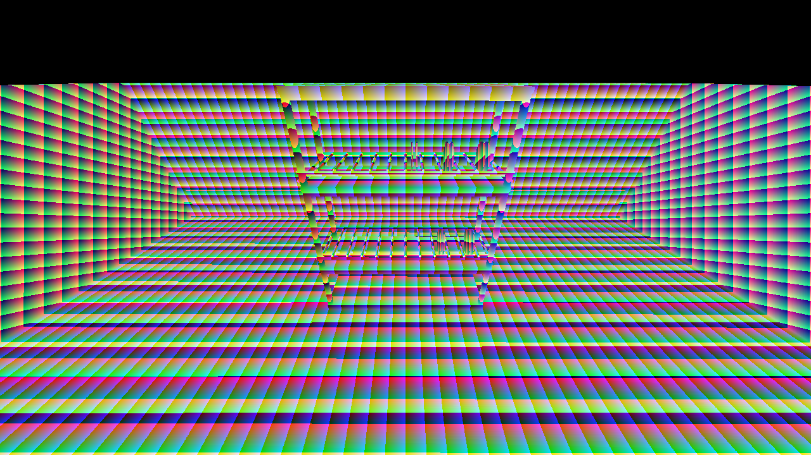

在得到逐像素的相机系坐标之后，我们使用自适应差分算子，估计每个像素的对应点在相机系下的归一化法线方向，此纹理记为normal。该算子通过参考目标像素的上下左右四个相邻像素的世界坐标，同时参考当前像素的深度，使用sigmoid控制混合比例，平滑地选取较平坦的一侧计算两轴的差分，用于估计表面的切线与副切线方向。

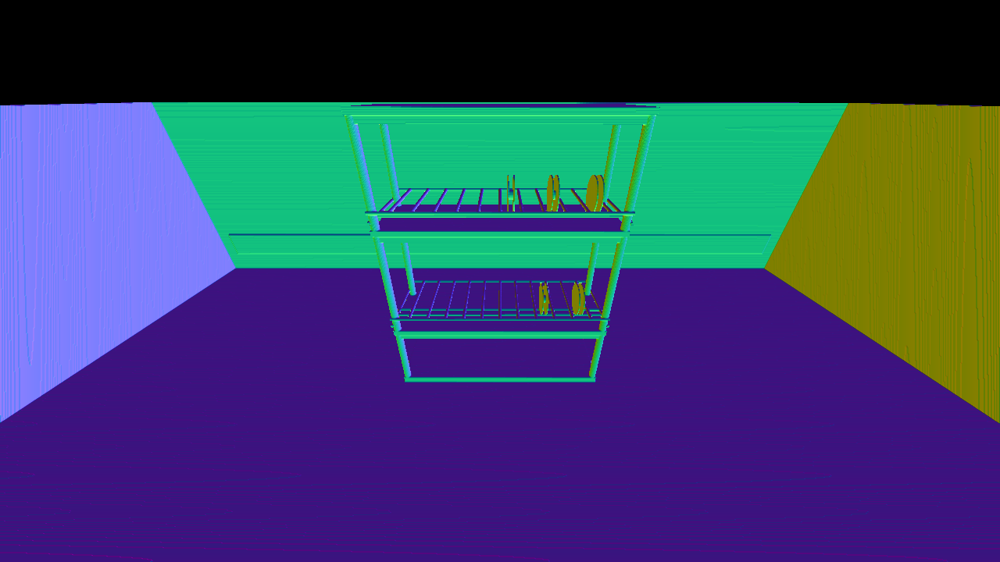

得到法线方向之后，我们需要一个与世界对齐的坐标系。选择原点位于摄像机头部，三轴与场景的长方体三轴对齐的坐标系作为目标坐标系。

首先，在bgr纹理上，HSV颜色空间中筛选与地面颜色（硬编码）相近的像素，为了避免YCbCr编码时色度伪影的影响，对得到的mask进行一次大核erode操作，将此mask记作groundMask。

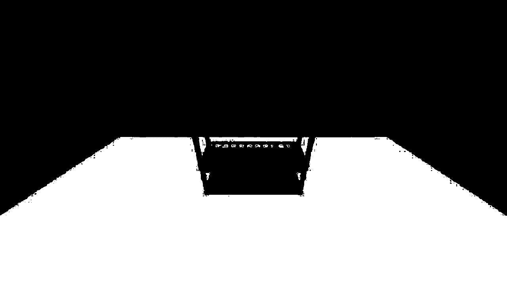

从normal中依据mask进行采样，并直接进行平均得到竖直向上的轴方向再归一化，记为groundNormal。

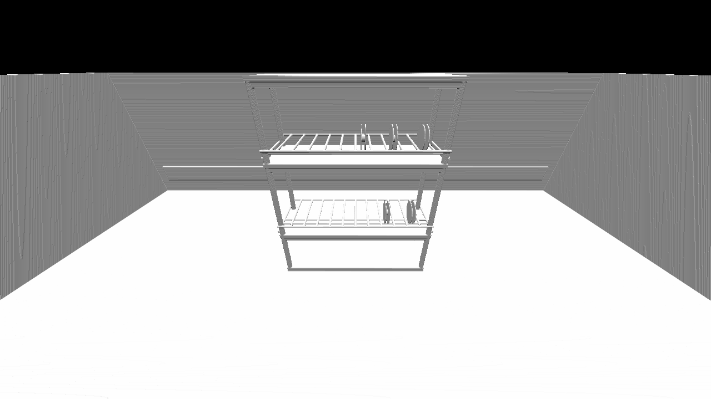

机器人的旋转较为缓慢，这利于我们计算另外的两个方向。

将groundNormal与normal进行点积，得到的纹理中，筛选值大于特定阈值的作为mask，记作verticalMask。

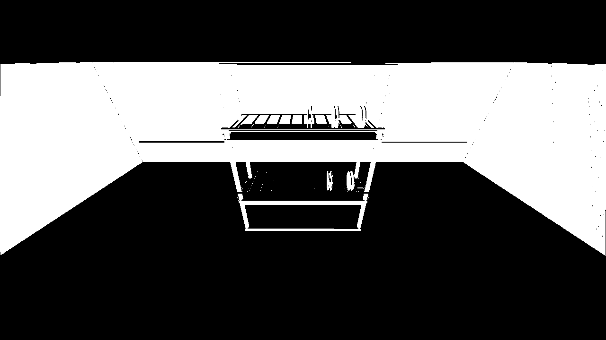

根据verticalMask对normal采样，得到的所有法线中，进行k=3的k-means聚类。对每一类，我们计算其归一化平均方向，并与这一类的所有法线进行点积，统计大于特定阈值的点积值数量。选取该数量最大的一类所对应的平均方向，记为sideDir。
对于首帧，我们记第二根轴为groundTangent，并直接令groundTangent等于sideDir。

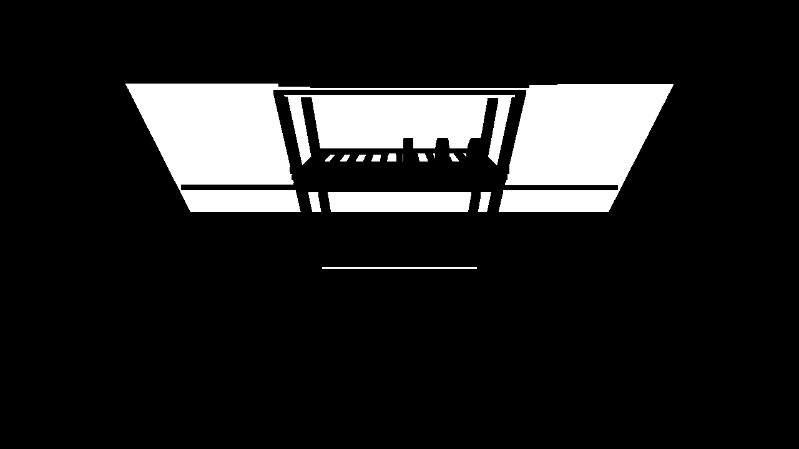
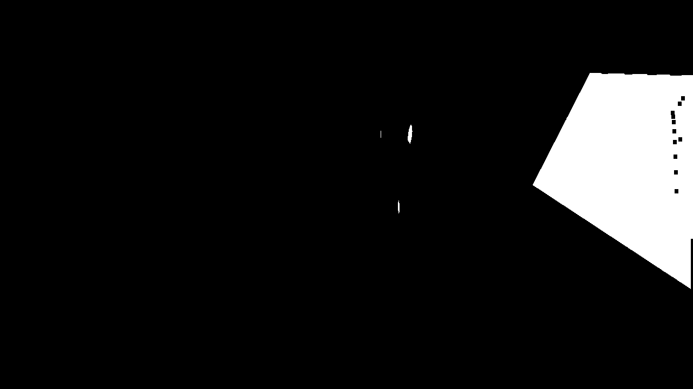
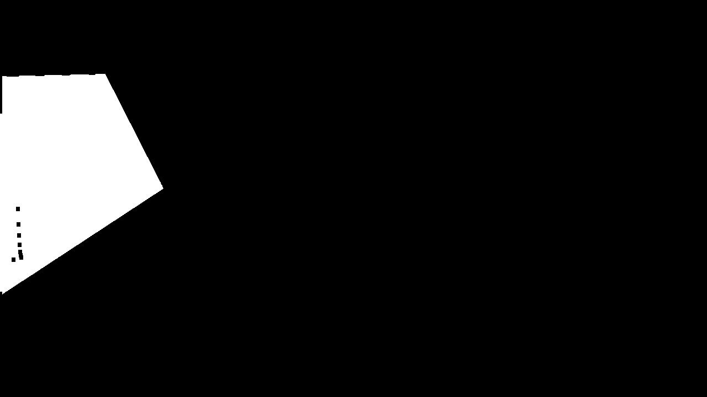
对于非首帧，我们在sideDir，-sideDir，sideDir×groundNormal，-sideDir×groundNormal四个方向中，选取与上一帧groundTangent夹角最小的一个方向，并用它更新groundTangent。至此我们得到了第二根轴方向，它始终指向机器人首帧看到的最大的一面墙的法线方向

使用groundTangent与groundNormal叉乘，得到groundBitangent，即第三轴。

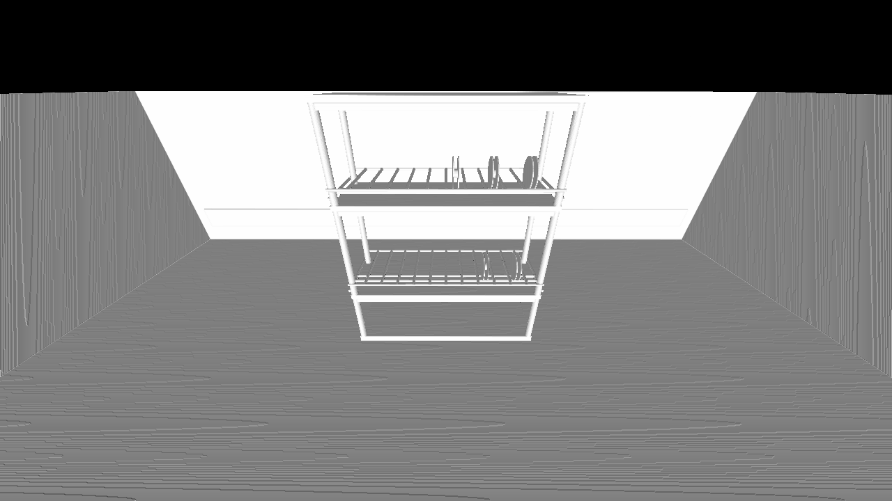
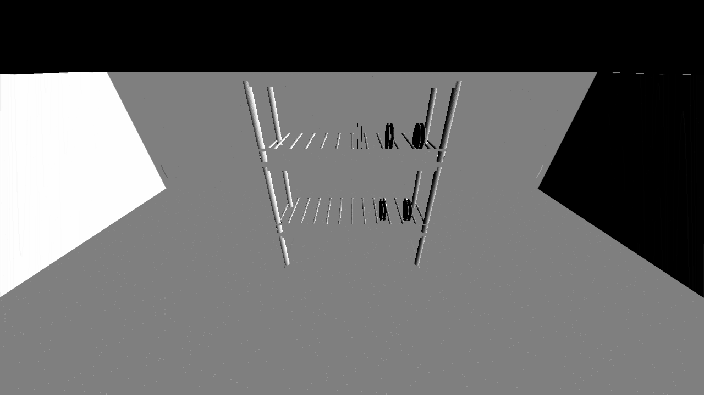

得到世界系的标准正交基底后，将normal和pos进行变换，得到worldNormal和worldPos。

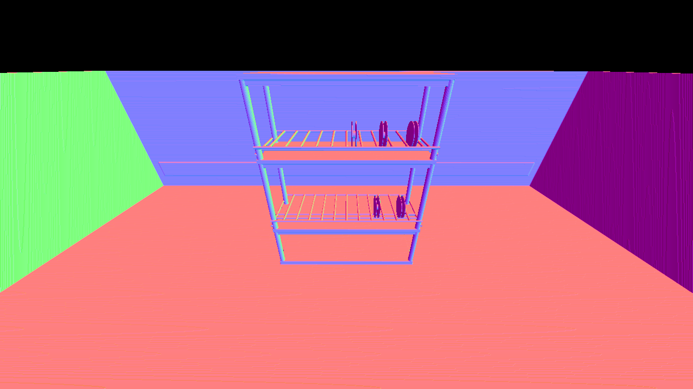
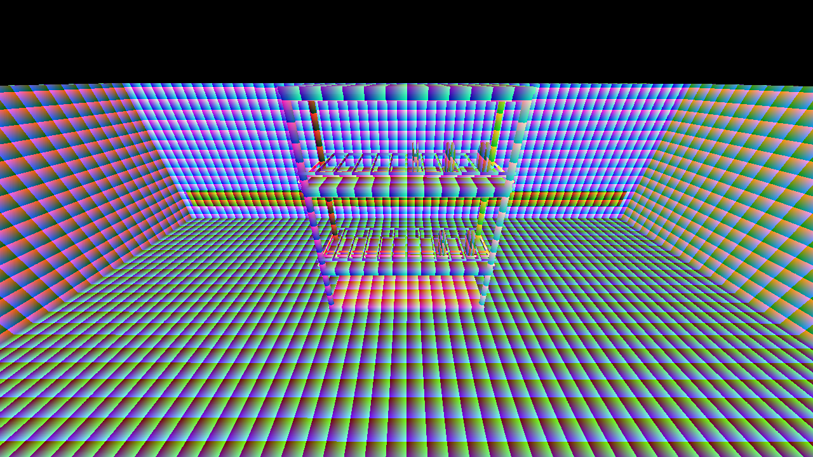

## 第二部分 剔除与初定位
有了一个固定方向的坐标系之后，我们需要借助它对视野进行剔除，以便下一步对目标物体进行定位。

首先，我们对worldPos进行四个方向的剔除：
worldPos在竖直方向最低的像素，以及距离最低200mm内的像素被剔除。
水平每根轴上最大/小的像素，以及距离最大/小200mm内的像素被剔除，除非它们的平均法线方向和它们的点积低于一定阈值的像素数量超出了一定阈值。（禁用剔除的条件保证了屏幕靠后的像素不被剔除，因为当视野中没有后方的墙时，就会错误剔除掉一些像素。前述的最大/小条件，是基于墙的几何特征的一种对墙的描述。）
此步骤后，我们成功剔除了墙体和地面。剩下的区域mask记为ROI（也剔除了架靠近地面和桌靠近地面的一部分，但不影响后续流程）。

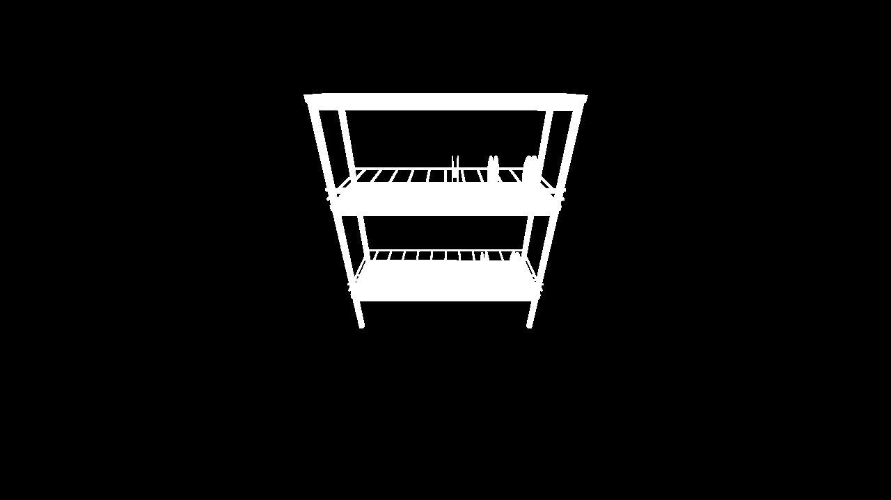

大部分情况下，料架和桌子很难同时出现在视野内。于是我们在ROI内对worldPos采样，统计其水平每轴最大和最小的5%像素，并将它们的对应轴坐标平均值作为一个水平边界框的四边位置。

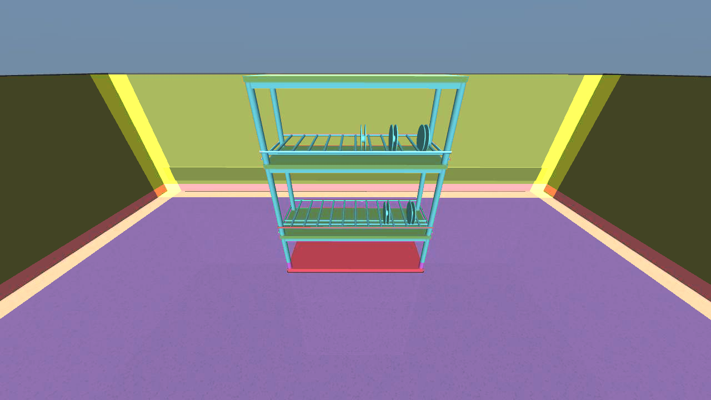

对于得到的水平边界框，在一定容差范围内，在长短边比和面积两个特征上判断其是否属于架子或者桌子的一类（两类无重叠部分）。对于这两类，分别做如下处理。

对于桌子：
- 复用groundMask，用其对worldPos采样，取平均值作为地面高度base。
- 剔除低于(base+桌子高度+100mm)的所有像素。（此时只剩下出料框）
- 与前述同样的方法完成其边界框的划定和顶部边界的划定。（投放位置已经确定）

对于架子：
- 对每一层，分别做剔除。剔除依据是一个根据base和架子的水平边界框确定的一个AABB，其包含了每一层架子上方的空间，不与架子重叠，但一定会与料盘重叠。
- 剔除AABB外的所有像素。
- 对剩下像素的架子横轴方向做k-means聚类，k=当前层料盘数目。

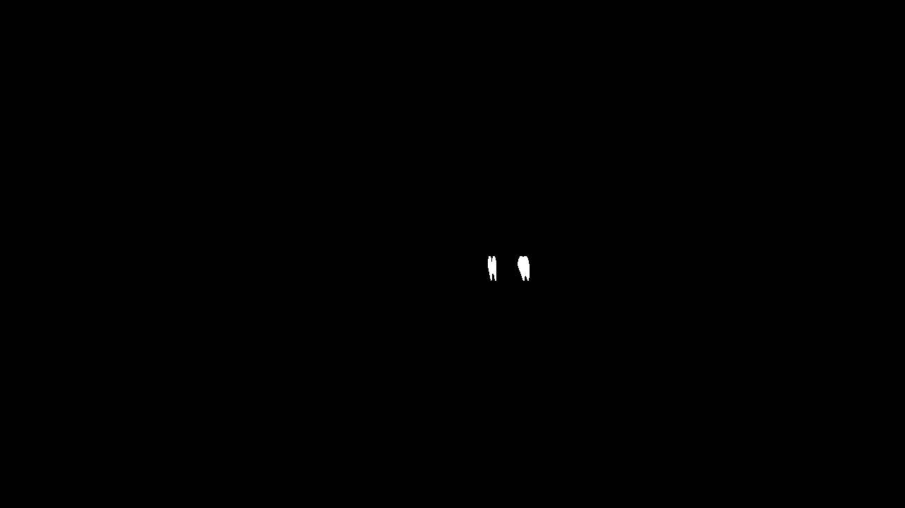
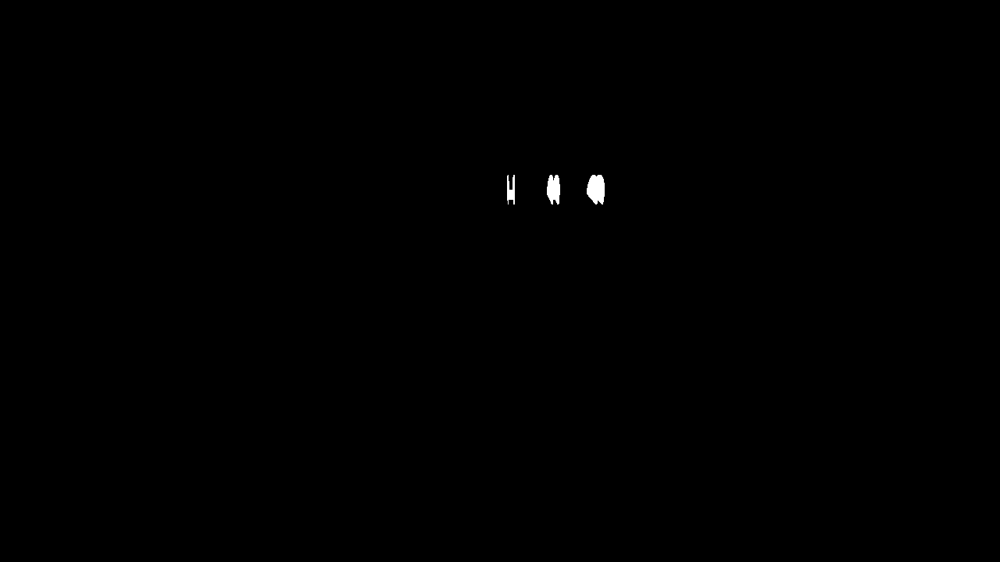
- 得到的三类分别与前述同样的方法完成其水平边界的划定和顶部边界的划定。其底部边界根据式（顶-底=后-前）估计。得到每一个料盘的精确边界框。

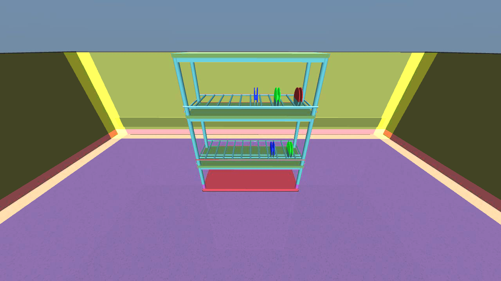

## 第三部分 变换与二次定位
接下来，需要根据TF树，把worldPos坐标的基转换到手部坐标系，同时根据原点做平移。

重新进行一次计算，根据深度和uv计算手部的pos，根据新的基计算得到worldPos。

使用手部算出的worldPos和头部算出的边界框的扩展，进行采样。对于每一个盘子，计算其在手部worldPos下的精确边界，用于手部导航。（其优点是无论手有没有看到料盘，都可以精准定位）

至此，整个感知的pipeline流程结束。已经提取出了足够的指导机器人动作的信息。

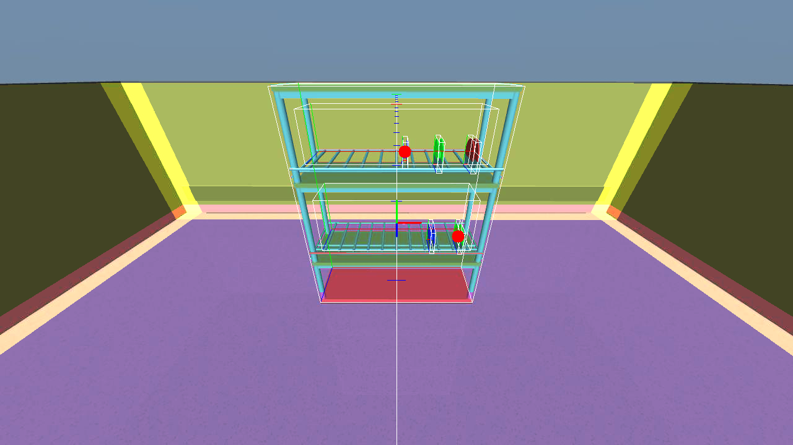